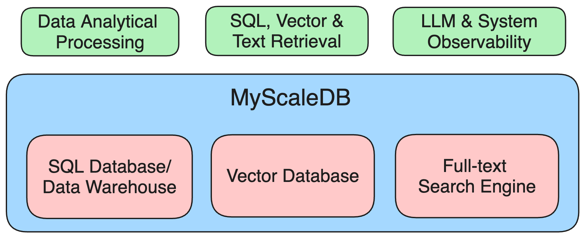

# MyScaleDB

<div align="center">

<a href='https://myscale.com/?utm_source=github&utm_medium=myscaledb'>
</img>
</a>
<br></br>

[](https://github.com/myscale/myscaledb/blob/main/LICENSE)
[](https://isocpp.org/)
[](https://discord.gg/D2qpkqc4Jq)
[](https://twitter.com/MyScaleDB)

[?style=for-the-badge>)](https://myscale.com/?utm_source=github&utm_medium=myscaledb_readme)
[?style=for-the-badge>)](https://console.myscale.com/playground/?utm_source=github&utm_medium=myscaledb_readme)
[](https://www.linkedin.com/company/myscale)

*Enable every developer to build production-grade GenAI applications with powerful and familiar SQL.*
</div>

## What is MyScaleDB?

MyScaleDB is the SQL vector database that enables developers to build production-ready and scalable AI applications using familiar SQL. It is built on top of **ClickHouse** and optimized for AI applications and solutions, allowing developers to effectively manage and process massive volumes of data. 

Key benefits of using MyScaleDB include:

* **Fully SQL-Compatible**
  * Fast, powerful, and efficient vector search, filtered search, and SQL-vector join queries.
  * Use SQL with vector-related functions to interact with MyScaleDB. No need to learn complex new tools or frameworks – stick with what you know and love.
* **Production-Ready for AI applications**
  * A unified and time-tested platform to manage and process structured data, text, vector, JSON, geospatial, time-series data, and more. See [supported data types and functions](https://myscale.com/docs/en/functions/)
  * Improved RAG accuracy by combining vectors with rich metadata, [full-text search](https://myscale.com/docs/en/text-search/), and performing high-precision, high-efficiency filtered search at any ratio[^1].
* **Unmatched performance and scalability**
  * MyScaleDB leverages cutting-edge OLAP database architecture and advanced vector algorithms for lightning-fast vector operations.
  * Scale your applications effortlessly and cost-effectively as your data grows.

[^1]: See why metadata filtering is crucial for imporoving RAG accuracy [here](https://myscale.com/blog/filtered-vector-search-in-myscale/#filtered-vector-search-is-essential-for-improving-the-accuracy-of-rag-systems).

[MyScale Cloud](https://myscale.com/product/) provides fully-managed MyScaleDB with premium features on billion-scale data[^2]. Compared with specialized vector databases that use custom APIs, MyScale is [more powerful, performant, and cost-effective](https://myscale.com/blog/myscale-outperform-specialized-vectordb) while remaining simpler to use. This makes it suitable for a large community of programmers. Additionally, when compared to integrated vector databases like PostgreSQL with pgvector or ElasticSearch with vector extensions, MyScale consumes fewer resources and [achieves better accuracy and speed for structured and vector joint queries](https://myscale.com/blog/myscale-vs-postgres-opensearch), such as filtered searches.

[^2]: The MSTG (Multi-scale Tree Graph) algorithm is provided through [MyScale Cloud](https://myscale.com), achieving high data density with disk-based storage and better indexing & search performance on billion-scale vector data.

## Why MyScaleDB

* Fully SQL compatible
* [Unified structured and vectorized data management](https://myscale.com/docs/en/joint-queries/)
* Millisecond search on billion-scale vectors
* Highly reliable & linearly scalable
* Powerful [text-search](https://myscale.com/docs/en/text-search/) and text/vector [hybrid search](https://myscale.com/docs/en/hybrid-search/) functions
* Complex SQL vector queries
* LLM observability with [MyScale Telemetry](https://github.com/myscale/myscale-telemetry)

MyScale unifies three systems: SQL database/data warehouse, vector database, as well as full-text search engine into one system in a highly efficient manner. It not only saves infrastructure and maintenance costs, but enables joint data queries and analytics as well.

<p align="center">

</p>

See our [documentation](https://myscale.com/docs/en/) and [blogs](https://myscale.com/blog/) for more about MyScale’s unique features and advantages. Our [open-source benchmark](https://myscale.github.io/benchmark/) provides detailed comparison with other vector database products.

## Why build MyScaleDB on top of ClickHouse?

[ClickHouse](https://github.com/ClickHouse/ClickHouse) is a popular open-source analytical database that excels at big data processing and analytics due to its columnar storage with advanced compression, skip indexing, and SIMD processing. Unlike transactional databases like PostgreSQL and MySQL, which use row storage and main optimzies for transactional processing, ClickHouse has significantly faster analytical and data scanning speeds.

One of the key operations in combining structured and vector search is filtered search, which involves filtering by other attributes first and then performing vector search on the remaining data. [Columnar storage and pre-filtering are crucial](https://myscale.com/blog/filtered-vector-search-in-myscale/#behind-the-scene) for ensuring high accuracy and high performance in filtered search, which is why we chose to build MyScaleDB on top of ClickHouse.

While we have modified ClickHouse's execution and storage engine in many ways to ensure fast and cost-effective SQL vector queries, many of the features ([#37893](https://github.com/ClickHouse/ClickHouse/issues/37893), [#38048](https://github.com/ClickHouse/ClickHouse/pull/38048), [#37859](https://github.com/ClickHouse/ClickHouse/issues/37859), [#56728](https://github.com/ClickHouse/ClickHouse/issues/56728), [#58223](https://github.com/ClickHouse/ClickHouse/pull/58223)) related to general SQL processing have been contributed back to the ClickHouse open source community.

## Quick Start

### MyScale Cloud

The simplest way to use MyScaleDB is to create an instance on MyScale Cloud service. You can start from a free pod supporting 5M 768D vectors. Sign up [here](https://myscale.com/) and checkout [MyScaleDB QuickStart](https://myscale.com/docs/en/quickstart/) for more instructions.

### Self-Hosted

#### Using MyScaleDB Docker Image
  
To quickly get a MyScaleDB instance up and running, simply pull and run the latest Docker image:

```bash
docker run --name myscaledb --net=host myscale/myscaledb:1.8.0
```

>Note: Myscale's default configuration only allows localhost ip access. For the docker run startup method, you need to specify `--net=host` to access services deployed in docker mode on the current node.

This will start a MyScaleDB instance with default user `default` and no password. You can then connect to the database using `clickhouse-client`:

```bash
docker exec -it myscaledb clickhouse-client
```

#### Using Docker Compose
  
1. Use the following recommended directory structure and the location of the `docker-compose.yaml` file:

```bash
> tree myscaledb
myscaledb
├── docker-compose.yaml
└── volumes
    └── config
        └── users.d
            └── custom_users_config.xml

3 directories, 2 files
```

2. Define the configuration for your deployment. We recommend starting with the following configuration in your `docker-compose.yaml` file, which you can adjust based on your specific requirements:

```yaml
version: '3.7'

services:
  myscaledb:
    image: myscale/myscaledb:1.8.0
    tty: true
    ports:
      - '8123:8123'
      - '9000:9000'
      - '8998:8998'
      - '9363:9363'
      - '9116:9116'
    networks:
      myscaledb_network:
        ipv4_address: 10.0.0.2
    volumes:
      - ${DOCKER_VOLUME_DIRECTORY:-.}/volumes/data:/var/lib/clickhouse
      - ${DOCKER_VOLUME_DIRECTORY:-.}/volumes/log:/var/log/clickhouse-server
      - ${DOCKER_VOLUME_DIRECTORY:-.}/volumes/config/users.d/custom_users_config.xml:/etc/clickhouse-server/users.d/custom_users_config.xml
    deploy:
      resources:
        limits:
          cpus: "16.00"
          memory: 32Gb
networks:
  myscaledb_network:
    driver: bridge
    ipam:
      driver: default
      config:
        - subnet: 10.0.0.0/24
```

`custom_users_config.xml`:

```xml
<clickhouse>
  <users>
      <default>
          <password></password>
          <networks>
              <ip>::1</ip>
              <ip>127.0.0.1</ip>
              <ip>10.0.0.0/24</ip>
          </networks>
          <profile>default</profile>
          <quota>default</quota>
          <access_management>1</access_management>
      </default>
  </users>
</clickhouse>
```

> Note: The custom_users_config configuration allows you to use the default user to access the database on the node where the database service is deployed using docker compose. If you want to access the database service on other nodes, it is recommended to create a user that can be accessed through other IPs. For detailed settings, see: [MyScaleDB Create User](https://myscale.com/docs/en/sql-reference/create-queries/#create-user). 
> You can also customize the configuration file of MyScaleDB. Copy the `/etc/clickhouse-server` directory from your `myscaledb` container to your local drive, modify the configuration, and add a directory mapping to the `docker-compose.yaml` file to make the configuration take effect:
>
> ```yaml
> - ${DOCKER_VOLUME_DIRECTORY:-.}/volumes/config:/etc/clickhouse-server
> ```

3. Use the following command to get it running:

```bash
cd myscaledb
docker compose up -d
```

4. Access the MyScaleDB command line interface using the following command.

```bash
docker exec -it myscaledb-myscaledb-1 clickhouse-client
```

5. You can now run SQL statements. See [Executing SQL Queries](https://myscale.com/docs/en/quickstart/#executing-sql-queries).

#### Building from source

The supported build environment is Ubuntu 22.04 with LLVM 15.0.7.

Please see the [scripts](https://github.com/myscale/MyScaleDB/tree/main/scripts) folder.

Example usage:

```bash
LLVM_VERSION=15 sudo -E bash scripts/install_deps.sh
sudo apt-get -y install rustc cargo yasm
bash scripts/config_on_linux.sh
bash scripts/build_on_linux.sh
```

The resulting executables will be in `MyScaleDB/build/programs/*`.

## Tutorial

See [Vector Search Documentation](https://myscale.com/docs/en/vector-search/) for how to create a SQL table with vector index and perform vector search. It's recommended to specify `TYPE SCANN` when creating a vector index in open source MyScaleDB.

### Create a Table with Vector Column

```sql
-- Create a table with body_vector of length 384
CREATE TABLE default.wiki_abstract
(
    `id` UInt64,
    `body` String,
    `title` String,
    `url` String,
    `body_vector` Array(Float32),
    CONSTRAINT check_length CHECK length(body_vector) = 384
)
ENGINE = MergeTree
ORDER BY id;
```

### Insert Data to Your Table

```sql
-- Insert data from parquet files on S3
INSERT INTO default.wiki_abstract SELECT * FROM s3('https://myscale-datasets.s3.ap-southeast-1.amazonaws.com/wiki_abstract_with_vector.parquet','Parquet');
```

### Create the Vector Index

```sql
-- Build a SCANN vector index with Cosine metric on the body_vector
ALTER TABLE default.wiki_abstract ADD VECTOR INDEX vec_idx body_vector TYPE SCANN('metric_type=Cosine');

-- Query the index build progress from the `vector_indices` table
-- Wait until the index progress becomes `Built`
SELECT * FROM system.vector_indices;
```

### Execute Vector Search

```sql
-- Perform vector search return the top-5 results
SELECT
  id,
  title,
  distance(body_vector, [-0.052, -0.0146, -0.0677, -0.0256, -0.0395, -0.0381, -0.025, 0.0911, -0.0429, -0.0592, 0.0017, -0.0358, -0.0464, -0.0189, -0.0192, 0.0544, -0.0022, -0.0292, -0.0474, -0.0286, 0.0746, -0.013, -0.0217, -0.0246, -0.0169, 0.0495, -0.0947, 0.0139, 0.0445, -0.0262, -0.0049, 0.0506, 0.004, 0.0276, 0.0063, -0.0643, 0.0059, -0.0229, -0.0315, 0.0549, 0.1427, 0.0079, 0.011, -0.0036, -0.0617, 0.0155, -0.0607, 0.0258, -0.0205, 0.0008, -0.0547, 0.0329, -0.0522, -0.0347, 0.0921, 0.0139, -0.013, 0.0716, -0.0165, 0.0257, -0.0071, 0.0084, -0.0653, 0.0091, 0.0544, -0.0192, -0.0169, -0.0017, -0.0304, 0.0427, -0.0389, 0.0921, -0.0622, -0.0196, 0.0025, 0.0214, 0.0259, -0.0493, -0.0211, -0.119, -0.0736, -0.1545, -0.0578, -0.0145, 0.0138, 0.0478, -0.0451, -0.0332, 0.0799, 0.0001, -0.0737, 0.0427, 0.0517, 0.0102, 0.0386, 0.0233, 0.0425, -0.0279, -0.0529, 0.0744, -0.0305, -0.026, 0.1229, -0.002, 0.0038, -0.0491, 0.0352, 0.0027, -0.056, -0.1044, 0.123, -0.0184, 0.1148, -0.0189, 0.0412, -0.0347, -0.0569, -0.0119, 0.0098, -0.0016, 0.0451, 0.0273, 0.0436, 0.0082, 0.0166, -0.0989, 0.0747, -0.0, 0.0306, -0.0717, -0.007, 0.0665, 0.0452, 0.0123, -0.0238, 0.0512, -0.0116, 0.0517, 0.0288, -0.0013, 0.0176, 0.0762, 0.1284, -0.031, 0.0891, -0.0286, 0.0132, 0.003, 0.0433, 0.0102, -0.0209, -0.0459, -0.0312, -0.0387, 0.0201, -0.027, 0.0243, 0.0713, 0.0359, -0.0674, -0.0747, -0.0147, 0.0489, -0.0092, -0.018, 0.0236, 0.0372, -0.0071, -0.0513, -0.0396, -0.0316, -0.0297, -0.0385, -0.062, 0.0465, 0.0539, -0.033, 0.0643, 0.061, 0.0062, 0.0245, 0.0868, 0.0523, -0.0253, 0.0157, 0.0266, 0.0124, 0.1382, -0.0107, 0.0835, -0.1057, -0.0188, -0.0786, 0.057, 0.0707, -0.0185, 0.0708, 0.0189, -0.0374, -0.0484, 0.0089, 0.0247, 0.0255, -0.0118, 0.0739, 0.0114, -0.0448, -0.016, -0.0836, 0.0107, 0.0067, -0.0535, -0.0186, -0.0042, 0.0582, -0.0731, -0.0593, 0.0299, 0.0004, -0.0299, 0.0128, -0.0549, 0.0493, 0.0, -0.0419, 0.0549, -0.0315, 0.1012, 0.0459, -0.0628, 0.0417, -0.0153, 0.0471, -0.0301, -0.0615, 0.0137, -0.0219, 0.0735, 0.083, 0.0114, -0.0326, -0.0272, 0.0642, -0.0203, 0.0557, -0.0579, 0.0883, 0.0719, 0.0007, 0.0598, -0.0431, -0.0189, -0.0593, -0.0334, 0.02, -0.0371, -0.0441, 0.0407, -0.0805, 0.0058, 0.1039, 0.0534, 0.0495, -0.0325, 0.0782, -0.0403, 0.0108, -0.0068, -0.0525, 0.0801, 0.0256, -0.0183, -0.0619, -0.0063, -0.0605, 0.0377, -0.0281, -0.0097, -0.0029, -0.106, 0.0465, -0.0033, -0.0308, 0.0357, 0.0156, -0.0406, -0.0308, 0.0013, 0.0458, 0.0231, 0.0207, -0.0828, -0.0573, 0.0298, -0.0381, 0.0935, -0.0498, -0.0979, -0.1452, 0.0835, -0.0973, -0.0172, 0.0003, 0.09, -0.0931, -0.0252, 0.008, -0.0441, -0.0938, -0.0021, 0.0885, 0.0088, 0.0034, -0.0049, 0.0217, 0.0584, -0.012, 0.059, 0.0146, -0.0, -0.0045, 0.0663, 0.0017, 0.0015, 0.0569, -0.0089, -0.0232, 0.0065, 0.0204, -0.0253, 0.1119, -0.036, 0.0125, 0.0531, 0.0584, -0.0101, -0.0593, -0.0577, -0.0656, -0.0396, 0.0525, -0.006, -0.0149, 0.003, -0.1009, -0.0281, 0.0311, -0.0088, 0.0441, -0.0056, 0.0715, 0.051, 0.0219, -0.0028, 0.0294, -0.0969, -0.0852, 0.0304, 0.0374, 0.1078, -0.0559, 0.0805, -0.0464, 0.0369, 0.0874, -0.0251, 0.0075, -0.0502, -0.0181, -0.1059, 0.0111, 0.0894, 0.0021, 0.0838, 0.0497, -0.0183, 0.0246, -0.004, -0.0828, 0.06, -0.1161, -0.0367, 0.0475, 0.0317]) AS distance
FROM default.wiki_abstract
ORDER BY distance ASC
LIMIT 5;
```

## Community

We're committed to continuously improving and evolving MyScaleDB to meet the ever-changing needs of the AI industry. Join us on this exciting journey and be part of the revolution in AI data management!

* [Discord](https://discord.gg/D2qpkqc4Jq)
* [Support](https://myscale.com/contact/)
* Get the latest MyScaleDB news or updates

  * Follow [@MyScaleDB](https://twitter.com/MyScaleDB) on Twitter
  * Follow [@MyScale](https://www.linkedin.com/company/myscale/) on LinkedIn
  * Read [MyScale Blog](https://myscale.com/blog/)

## Roadmap

* [x] Inverted index & performant keyword/vector hybrid search ([supported since 1.5](https://myscale.com/blog/text-search-and-hybrid-search-in-myscale/))
* [x] Support more storage engines, e.g. `ReplacingMergeTree` ([supported since 1.6](https://myscale.com/blog/select-with-final/))
* [x] LLM observability with MyScaleDB and [MyScale Telemetry](https://github.com/myscale/myscale-telemetry)
* [ ] Data-centric LLM
* [ ] Automatic data science with MyScaleDB

## License

MyScaleDB is licensed under the Apache License, Version 2.0. View a copy of the [License file](https://github.com/myscale/myscaledb?tab=License-1-ov-file).

## Credits

We give special thanks for these open-source projects, upon which we have developed MyScaleDB:

* [ClickHouse](https://github.com/ClickHouse/ClickHouse) - A free analytics DBMS for big data.
* [Faiss](https://github.com/facebookresearch/faiss) - A library for efficient similarity search and clustering of dense vectors, by Meta's Fundamental AI Research.
* [hnswlib](https://github.com/nmslib/hnswlib) - Header-only C++/python library for fast approximate nearest neighbors.
* [ScaNN](https://github.com/google-research/google-research/tree/master/scann) - Scalable Nearest Neighbors library by Google Research.
* [Tantivy](https://github.com/quickwit-oss/tantivy) - A full-text search engine library inspired by Apache Lucene and written in Rust.
