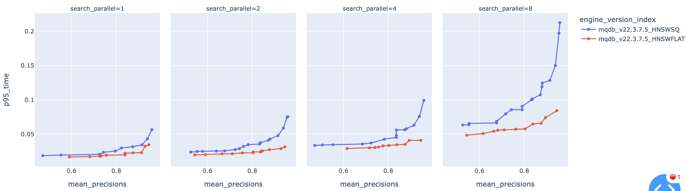
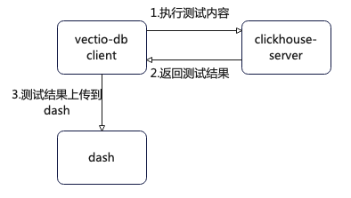
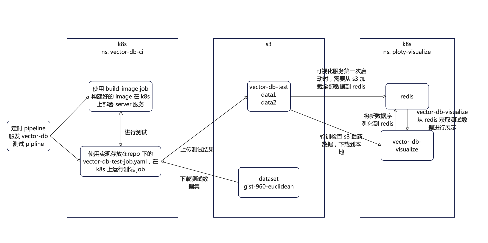

# gitlab-ci 集成 vector-db 设计文档

- 作者: @shanfengp
- 讨论该文档的 MR: <https://git.moqi.ai/mqdb/ClickHouse/-/merge_requests/135>

## 简介

主要介绍如何将 vector-db 集成到 gitlab-ci 进行自动化测试

## 动机与背景

目前 @mochix 在本地使用 vector-db + dash 实现了对 mqdb、pinecone 等数据库的 qps、precision、index_build_time 的一些重要数据进行测试收集，并通过图表讲这些数据直观的展现出来，如下图所示

  

但是目前 mqdb 版本变动比较频繁，对于每个版本，都需要重新手动运行测试程序，这就可能由于操作疏忽等问题，造成测试结果不正确，重新测试又会浪费宝贵的测试时间，所以，本文档的目标是向开发人员介绍，如何利用 gitlab-ci + k8s 部署一套可以自动化运行 vector-db-benchmark 并将测试数据发送到前台展示 pipeline

## 设计方案

### 当前本地实现方案

当前 vector-db 本地测试使用 cs 架构，利用 python SDK 实现 clickhouse-server 与 vector-db-benchmark 之间的测试通信，但是，目前本地测试流程比较繁琐，clickhouse-server 与 vector-db-benchmark 需要分别启动，并且 vector-db-benchmark 的启动极其依赖 clickhouse-server 相关的配置，测试结束后，需要进入到 vector-db-benchmark 的容器当中，手动的将测试结果传输到 dash 的数据目录，从以往的经验中可知，测试过程中每多一步手动操作，都会增加后续测试结果出现错误的风险，所以实现自动化的 vector-db-benchmark 测试是必要的。
目前本地 vector-db-benchmark 测试 pipeline 的数据交互如下图所示

其中，本地对于操作 1、2 已经实现自动化，对于操作3、 clickhouse-server 以及 vector-db 的运行还需要手动操作，例如启动 clickhouse-server 时，需要替换启动文件中 image version 为待测试版本，启动 vector-db-benchmark 时需要根据 clickhouse-server 的 ip、version 参数配置相关运行参数。
### 基于 gitlab-ci 实现 vector-db 自动化测试
利用 gitlab-ci 自动化操作对目前本地实现方案全程自动化，整个测试流程如下：

  

使用 gitlab-ci 的 schedules pipline，设置定时的 pipeline 触发 mqdb-dev 分支的 vector-db 测试。整个测试流程如下：  
1. 根据 build image 构建出来的镜像，在 k8s 上运行用于测试的 mqdb server
2. 等待 server 成功运行之后，在同一 namespace 下运行用于测试的 vector-db-test-job，该 job 会下载用于测试的数据集 → 进行测试 → 测试结束后上传测试结果到 vector-db-test → 运行在 ploty-visualize ns 下的 vector-db-visualize 会间隔一定的时间从 s3 更新数据到 redis → vector-db-visualize 从 redis 获取预览数据，进行前台展示  

测试人员如果想要在 ci 中触发 vector-db 测试，需要在 schedule pipeline 的设置页面添加如下 Variables

| Variables | type | Value | Describe |
|-----------|------|-------|----------|
|CI_TEST_VECTOR_DB|Variable|true|提示每个 job，该 pipeline 由 vector-db-benchmark 测试触发|
|KUBECONFIG_CONTENT|File|k8s-config-file|k8s 集群配置文件|

## 影响与风险

对于 MQDB 代码无任何影响

## 未完成工作

- 介绍本地如何使用 vector-db-benchmark 进行测试
- vector-db-visualize 设计文档
